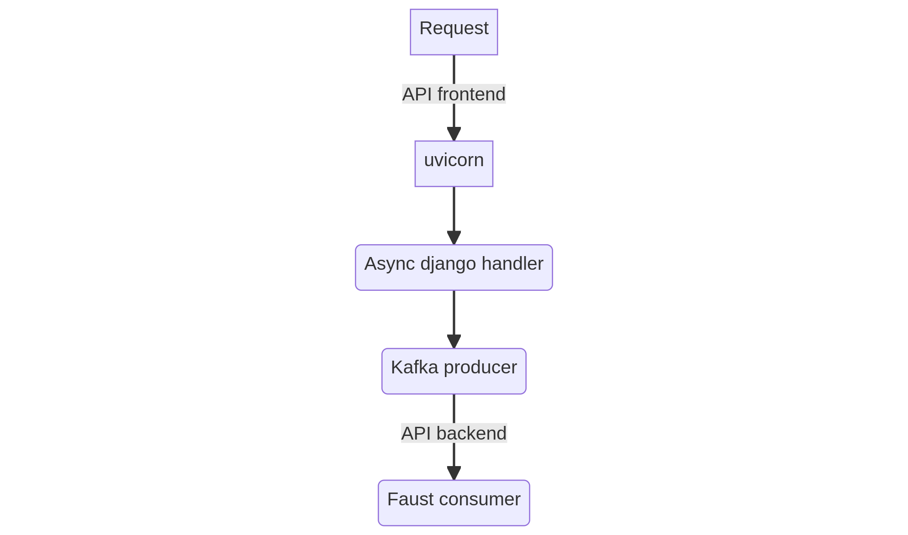

# Quickstart

1. Make sure port `8888` is open
2. Run `docker compose up` to start the app
3. Apply migrations `docker compose run web python manage.py migrate`
4. Open a new tab and run `docker compose restart faust` (found a bug in Faust on PY3.11, already reported to the devs)
5. Send some data

```
curl -v --location --request POST 'http://localhost:8888/items/' \
--header 'Accept: application/json' \
--header 'Content-Type: application/json' \
--data-raw '{
    "external_id": "0xdeadbeef",
    "name": "lcamtuf",
    "value": 1337
}'
```
6. Check the DB `docker compose run web python manage.py shell`


```
>>> from apps.cart.models import Cart;Cart.objects.all();
<QuerySet [<Cart: c0630b20-4404-4478-ba00-13a340221e16>]>
>>> from apps.cart.models import Item;Item.objects.all();
<QuerySet [<Item: lcamtuf - 1337>]>

```


# Overview

> You may assume that there is some kind of javascript code placed in various stores that
> will feed the data to our tracker (according to the specification listed below).

> Returns - 204 No Content

Tracking apps are transparent to end users so, I can defer the process of saving a record effectively making the `/items/` endpoint sql-less (if the user has an active cart assigned to the session)

Data flow looks roughly like this:




# Frontend Performance

`docker compose -f docker-compose.locust.yaml up --scale worker=4`

`docker compose stop faust` - Backend performance is not important in this test
    
then go to [http://localhost:8089](http://localhost:8089) or see the report at [docs/locust_report.html](docs/locust_report.html)

# Code style

see `.pre-commit-config.yaml`

# Tests

Run `docker compose run web pytest` to tests the app
